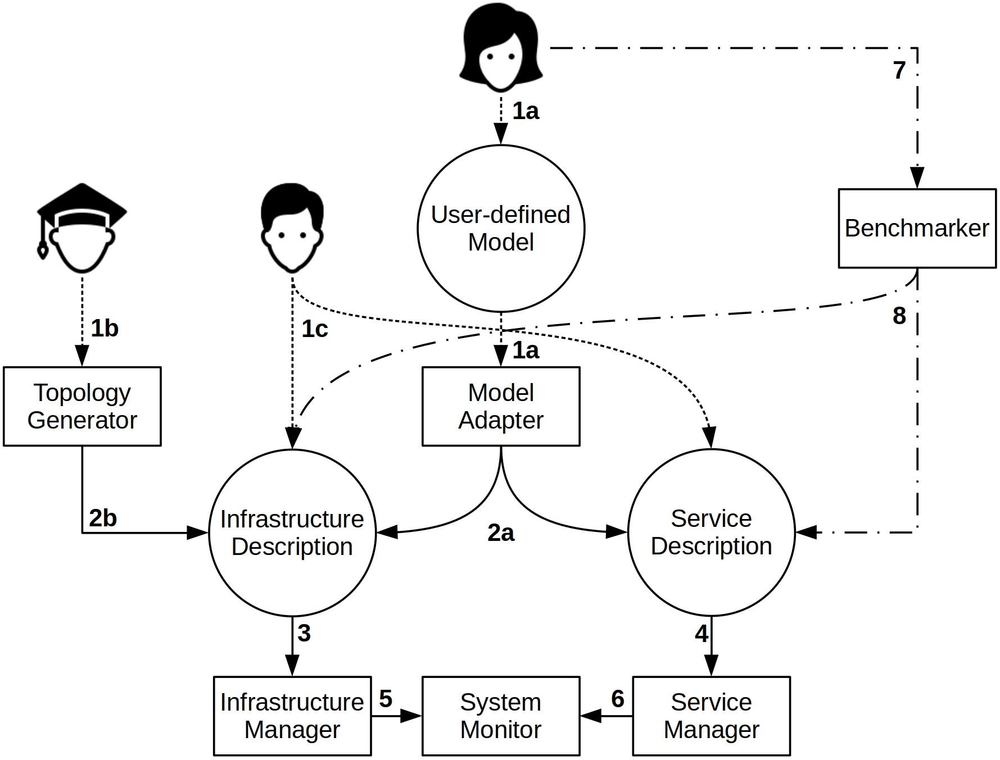

# eXP-RAN - an Emulator for Gaining Experience with Radio Access Networks, Edge Computing, and Slicing

eXP-RAN was tested in Ubuntu 18.04 LTS and Ubuntu Server 18.04 LTS. Although it may work in some other Debian-based Linux distributions, we do not guarantee that all features will work well.

- [Getting started](#getting-started)
	- [Installing the prerequisites](#installing-the-prerequisites)
	- [Xen configuration](#xen-configuration)
	- [Cloning the repository](#cloning-the-repository)
	- [Downloading the VM Template](#downloading-the-vm-template)
	- [Creating the eXP-RAN user](#creating-the-exp-ran-user)
- [Interacting with the tool](#interacting-with-the-tool)
	- [Model Adapter](#model-adapter)
	- [Topology Generator](#topology-generator)
	- [Creating your own Infrastructure and Service description files](#creating-your-own-infrastructure-and-service-description-files)
	- [Benchmarker](#benchmarker)
- [Creating an emulation](#creating-an-emulation)
	- [vRAN/MEC emulation](#vRANMEC-emulation)
	- [Video streaming emulation](#video-streaming-emulation)
- [System Monitor | Analyzing the emulation results](#system-monitor--analyzing-the-emulation-results)
- [Destroying an emulated infrastructure](#destroying-an-emulated-infrastructure)
- [eXP-RAN IEEE Access Paper](#exp-ran-ieee-access-paper)
- [Video tutorial](#video-tutorial)
- [Contact us](#contact-us)

## Getting started

These instructions will guide you to get eXP-RAN up and running.

### Installing the prerequisites

```
sudo apt update
sudo apt install python net-tools unzip python-pip iproute2 xen-hypervisor-4.6-amd64 xen-tools openvswitch-switch openssh-server curl git
sudo pip install paramiko networkx
```

### Xen configuration

After installing the Xen Hypervisor, you need to restart your computer to load the hypervisor.

Optional configuration: It is **highly** recommend to configure the Xen dom0 RAM, more information regarding this configuration can be found in the [Xen Project Documentation](https://wiki.xenproject.org/wiki/Xen_Project_Best_Practices).

### Cloning the repository

```
git clone https://github.com/LABORA-INF-UFG/eXP-RAN
```

### Downloading the VM Template

Now you need to download eXP-RAN's Xen VM.

In order to do that, first enter the [Xen VM](XenVM/) directory inside the repository you just cloned, then run the VM Downloader script.

```
sh VMDownloader.sh
```

Once that is done, you should have two files downloaded to your machine, one is the VM disk and the other is the VM swap disk.

### Creating the eXP-RAN user

In order for eXP-RAN to save the results of the emulation tests from the VMs to your host, you need to create a user on your host for eXP-RAN.

This is necessary because eXP-RAN copy the results from the VMs to your host via [SCP](https://help.ubuntu.com/community/SSH/TransferFiles), and instead of asking for the user's password to transfer the files, a more secure approach is to a create a user without root permissions only to copy the results files.

To create your non-root eXP-RAN user, simply type:

```
sudo useradd -m expran -s /bin/bash
```

For eXP-RAN to work properly, the eXP-RAN user password has to be "necos". You can set eXP-RAN's password with the following command:

```
sudo passwd expran
```

Then, type necos for "Enter new UNIX password:" and "Retype new UNIX password:".

Remember that this user is a non-root user and it is only going to be used for SCP, so the are no big security issues regarding the creation of this user.

Nonetheless, you can delete this user at any moment by typing: sudo userdel expran && sudo rm -rf /home/expran

Alternatively, eXP-RAN has a [module](#destroying-an-emulated-infrastructure) to destroy the created infrastructure. This module already deletes eXP-RAN's user after the emulation is done.

Now eXP-RAN is fully configured and you can start your tests!

## Interacting with the tool

There are three ways in which the user can interact with the tool. The figure below details these interactions.

<div align="center">

</div>

The figure above represents eXP-RAN workflow and system modules.

Single arrows represent mandatory flow; arrows only with dashed lines identify user inputs; arrows composed by dots and dashed lines represent optional flow; rectangles identify the system modules and circles represent input files. Note that step 7 has double meaning as it is an optional flow and an user input.

Let's start with the Model Adapter module.

### Model Adapter

The model adapter is responsible for converting the output of a [CPLEX](https://www.ibm.com/analytics/cplex-optimizer) optimisation model into an Infrastructure and Service description file (step 2a in the [figure above](#interacting-with-the-tool)) for eXP-RAN.

The Infrastructure Description file can be used to emulate any service. However, the Service Description file generated by the model adapter can only be used to emulate vRAN/MEC services.

This module must be implemented by the user for each different model to be evaluated. However, this is much easier then implementing the solution from scratch, since eXP-RAN specifies well defined interfaces and generalizations so that a plethora of different models can be converted and have their performance assessed.

The model adapter is at [Scripts/Model_Adapter/](Scripts/Model_Adapter/).

You can run the model adapter by running the following script combined with the solution and topology file generated by CPLEX. The username information is also necessary. Example:

```
python model_adapter.py -u username -s solutionFile -t topologyFile
```

Where:\
&nbsp;&nbsp;&nbsp;&nbsp;&nbsp;&nbsp; -u (string) – Your username.\
&nbsp;&nbsp;&nbsp;&nbsp;&nbsp;&nbsp; -s (file) – Your solution file.\
&nbsp;&nbsp;&nbsp;&nbsp;&nbsp;&nbsp; -t (file) – Your topology file.

Here is an example:

```
python model_adapter.py -u Mark -s sol_fluidran.json -t top_file.json
```

After running the script, both the infrastructure and vRAN/MEC service description files are going to be exported to the same directory of the model adapter.

The optimisation model of the example is the [FluidRAN model](https://ieeexplore.ieee.org/document/8486243).

### Topology Generator

The topology generator is designed to generate random RAN topologies.

We use a [Waxman graph](https://networkx.github.io/documentation/networkx-1.10/reference/generated/networkx.generators.geometric.waxman_graph.html) to generate the topology, a type of graph very similar to the topologies usually found in RANs.

The topology generator is at [Scripts/Topology_Generator/](Scripts/Topology_Generator/).

You can run the topology generator by running the following script combined with the Waxman arguments:

```
python top_gen.py -u username -n NumberOfNodes -a Alpha -b Beta -l L
```

Where:\
&nbsp;&nbsp;&nbsp;&nbsp;&nbsp;&nbsp; -u (string) – Your username.\
&nbsp;&nbsp;&nbsp;&nbsp;&nbsp;&nbsp; -n (int) – Number of nodes.\
&nbsp;&nbsp;&nbsp;&nbsp;&nbsp;&nbsp; -a (float) – Alpha Model parameter.\
&nbsp;&nbsp;&nbsp;&nbsp;&nbsp;&nbsp; -b (float) – Beta Model parameter.\
&nbsp;&nbsp;&nbsp;&nbsp;&nbsp;&nbsp; -l (float) – Maximum distance between nodes.

Here is an example of how to use the script:

```
python top_gen.py -u John -n 3 -a 0.4 -b 0.1 -l 70
```

The JSON output containing the topology description is located at the same directory of the topology generator script.

Once the topology is created, nodes are labeled according to the following proportions: 5% of the nodes are labed MEC host nodes; 30% are base stations nodes; and 65% are forwarding nodes. This was based on studies conducted in [this paper](https://ieeexplore.ieee.org/document/7248926).

Finally, links are characterized by randomly choosing one of the links profiles derived from studies conducted in [this paper](https://ieeexplore.ieee.org/document/8283832). The generated topology is then converted into a Infrastructure Description file (step 2b in the [figure above](#interacting-with-the-tool)).

Keep in mind that only the RAN topology is generated. The user needs to create the Docker containers information as well as the service file.

However, the topology generator helps users with limited knowledge of RAN/EC scenarios and supports educational purposes.

### Creating your own Infrastructure and Service description files

The third method of interaction allows the user to specify his own infrastructure and services files (step 1c in the [figure above](#interacting-with-the-tool)), which can be very useful for small use-cases.

In this case, the user describes the infrastructure and services by writing JSON files following the eXP-RAN notation.

eXP-RAN infrastructure and services files examples can be found in the [DescriptionFiles](DescriptionFiles/) directory.

Where:\
&nbsp;&nbsp;&nbsp;&nbsp;&nbsp;&nbsp; [simple_vran_infra.json](DescriptionFiles/simple_vran_infra.json) – A simple vRAN Infrastructure Description file example.\
&nbsp;&nbsp;&nbsp;&nbsp;&nbsp;&nbsp; [simple_vran_services.json](DescriptionFiles/simple_vran_services.json) – A simple vRAN Service Description file example.\
&nbsp;&nbsp;&nbsp;&nbsp;&nbsp;&nbsp; [fluidRAN_Infra.json](DescriptionFiles/fluidRAN_Infra.json) – FluidRAN model Infrastructure Description file example.\
&nbsp;&nbsp;&nbsp;&nbsp;&nbsp;&nbsp; [fluidRAN_services.json](DescriptionFiles/fluidRAN_services.json) – FluidRAN model Service Description file example.\
&nbsp;&nbsp;&nbsp;&nbsp;&nbsp;&nbsp; [simple_video_infra.json](DescriptionFiles/simple_video_infra.json) – A simple video streaming Infrastructure Description file example.\
&nbsp;&nbsp;&nbsp;&nbsp;&nbsp;&nbsp; [simple_video_services.json](DescriptionFiles/simple_video_services.json) – A simple video streaming Service Description file example.\
&nbsp;&nbsp;&nbsp;&nbsp;&nbsp;&nbsp; [videoStream_Infra.json](DescriptionFiles/videoStream_Infra.json) – Video streaming Infrastructure Description file example.\
&nbsp;&nbsp;&nbsp;&nbsp;&nbsp;&nbsp; [videoStream_services.json](DescriptionFiles/videoStream_services.json) – Video streaming Service Description file example.

Things to note when creating your own Infrastructure and Service description files:

* The same Infrastructure Description file can support both vRAN/MEC and video streaming service files. We uploaded different Infrastructure Description files just to give more examples to the user.
* When numbering your nodes in the Infrastructure Description file, always start at zero and make an increasing number.
* The first node in the service file is the one generating the network traffic, and the last node is the one receiving the network traffic. The nodes in the middle describe the path of the flow. Remember to always match the first node with the "ctnSourceNum" and the last node with the "ctnTargetNum".
* In the video streaming service file, the first node number should always be the same, as it is going to be the video server. The video client is the last node, and it should always alternate between two nodes, in order to represent "Premium" and "Best-Effort" clients. Always add your "Premium" client first, then add your "Best-Effort" client secondly. For example, in the [videoStream_services.json](DescriptionFiles/videoStream_services.json), the "Premium" client is at node 16, the "Best-Effort" is at node 6 and they always alternate in the description file. This use-case is more detailed [later](#video-streaming-emulation).
* The only attribute that is exclusive to the vRAN/MEC service description file is the attribute "bandwidth", the rest of the attributes are the same.
* If you would like to emulate splitted flows in the vRAN/MEC use-case, the first and last node should be the same. For example, in the [fluidRAN_services.json](DescriptionFiles/fluidRAN_services.json), flows 11 and 12 have the same source and destination. eXP-RAN splits the flow by setting different values to the Type of Service (ToS) field in each packet of the flow.
* There are three types of nodes, the "Forwarding" node has no computational capacity and it is only used to do packet forwarding. The "BaseStation" node has some computational capacity and usually is the destination of the network flows. Finally, the "MECHost" represents the processing power of the RAN, has lots of computational capacity and usually is the source of the network flows. Nonetheless, users can determine the computational capacity of each node and who is the source/destination of each flow as they wish.

### Benchmarker

The Benchmarker module (step 7 in the [figure above](#interacting-with-the-tool)) is a powerful built-in feature in eXP-RAN. The Benchmarker ensures the predictable performance requirement by configuring the eXP-RAN tool according to the hardware capacity where it is running. In this context, this module helps the user making wise choices during the process of configuring an emulator, specially when the user is creating his own infrastructure and services description files (step 1c in the [figure above](#interacting-with-the-tool)).

Please note that the benchmarker is only available for the vRAN/MEC service emulation. Its usage is optional, but it is recommended.

The benchmarker is at [Scripts/Benchmarker/](Scripts/Benchmarker/).

You can run the benchmarker by running the following script combined with the arguments:

```
sudo python benchmarker.py -b bandwidth -p packetloss -d duration -s1 scaleRatio1 -s2 scaleRatio2
```

Where:\
&nbsp;&nbsp;&nbsp;&nbsp;&nbsp;&nbsp; -b (float) – Best case scenario bandwidth (in Mbps).\
&nbsp;&nbsp;&nbsp;&nbsp;&nbsp;&nbsp; -p (float) – Accepted packet loss (%).\
&nbsp;&nbsp;&nbsp;&nbsp;&nbsp;&nbsp; -d (int) – Duration of each individual test (in seconds).\
&nbsp;&nbsp;&nbsp;&nbsp;&nbsp;&nbsp; -s1 (float) – First number of the scale ratio.\
&nbsp;&nbsp;&nbsp;&nbsp;&nbsp;&nbsp; -s2 (float) – Second number of the scale ratio.

Here is an example of how to use the script:

```
sudo python benchmarker.py -b 50000 -p 1 -d 60 -s1 10 -s2 100
```

Things to note about the benchmarker:

* The longer the duration of each individual test, the most accurate results you are going to get. Also, running the benchmarker multiple times reduces variance and produces a more accurate recommendation.
* In the the second phase, when the benchmarker is very vCPU limited, e.g. 0.1 or 0.2 vCPU, your hardware might struggle to generate/process the throughput, and the results may vary a bit. Following the recommendation above should reduce the variance in such cases.
* The arguments -s1 and -s2 are optional, if you choose not set them, the defaults are: -s1 2 -s2 10.

Now, you should have both your infrastructure and services files created by any of the methods above. It is emulation time!

## Creating an emulation

In this section, we discuss two use-cases that illustrate some of the benefits of using eXP-RAN, and how our tool contributes to experimentation with RAN and EC.

The emulation scripts are located at [Scripts/Emulation](Scripts/Emulation/).

### vRAN/MEC emulation

In the [FluidRAN model](https://ieeexplore.ieee.org/document/8486243), the authors present the FluidRAN Design Problem (FRD) that has an objective function to minimize the network operator costs while satisfying the users' demand. The costs are related to data transfer and the computing resources necessary for the VNFs of the vRAN, in order to satisfy the throughput demanded by the users.

The authors identify that FRD is NP-hard to solve and so they employed the Benders' decomposition method to approach the problem. Analysing the robustness of a solution generated by the FluidRAN model or making a sensitivity analysis of the model are very time-consuming. In this context, eXP-RAN becomes an useful tool, since it makes it possible to perform tests by varying different parameters of interest and collecting several metrics.

eXP-RAN uses tools such as [Linux Traffic Control](https://man7.org/linux/man-pages/man8/tc.8.html) and [OvS](https://www.openvswitch.org/) with Openflow rules to create an emulated RAN that is similar to the one modeled in the description files, e.g. FluidRAN. The network flows are generated by a containerized version of the [iPerf software](https://iperf.fr/).

After creating your infrastructure and vRAN/MEC service files, you can start your vRAN/MEC emulation.

Here is an example of how to use the script:

```
sudo python emulation.py -e vran -t 1200 -i ../../DescriptionFiles/simple_vran_infra.json -s ../../DescriptionFiles/simple_vran_services.json
```

Where:\
&nbsp;&nbsp;&nbsp;&nbsp;&nbsp;&nbsp; -e (string) – Emulation type, should always be "vran" in this case.\
&nbsp;&nbsp;&nbsp;&nbsp;&nbsp;&nbsp; -t (int) – Duration of each individual test (in seconds).\
&nbsp;&nbsp;&nbsp;&nbsp;&nbsp;&nbsp; -i (file) – Infrastructure description file.\
&nbsp;&nbsp;&nbsp;&nbsp;&nbsp;&nbsp; -s (file) – Service description file.

### Video streaming emulation

In this use-case, we illustrate how eXP-RAN can emulate a network slice in which a video service provider can easily deploy his service and differentiate the video delivery to his users.

The video service deployed in this use-case consists of a containerized version of the [FFmpeg software](https://ffmpeg.org/). The clients receive 1080p video at a Constant Bit Rate (CBR). We assume the video service provider has two types of clients: "Best-Effort" that represents how users receive their video content nowadays and "Premium" that represents a new class of users willing to pay an higher fee to receive their video content with assured quality.

Going back to our [videoStream_services.json](DescriptionFiles/videoStream_services.json) example. Flows 1 and 2 will be deployed at the same time (Instant 1). Flow 1 is a "Premium" client and flow 2 is a "Best-Effort" one. After some period of time, specified by the user a new set of "Premium" and "Best-Effort" clients is going to be deployed, i.e., flows 3 and 4 (Instant 2). The quality of the "Premium" clients will remain untouched, and all the "Best-Effort" clients will either start with a reduced quality (if is going to be deployed at instant 2) or have its quality divided by 2 (if it was already running).

In short, the quality of the video of the "Premium" quality will remain the same, while the quality of the video of the "Best-Effort" clients will be divided by two once a new pair of "Premium" and "Best-Effort" is deployed.

For example, imagine that both "Premium" and "Best-Effort" clients start with a video quality of 1 Mbps, let's analyse at Instant 1:

| flowIdentifier|Type of client| Quality 	 |
|:-----------: 	|:-----------: |:-----------:|
| 		1		|Premium 1	   |	1 Mbps	 |
| 		2		|Best-Effort 1 |    1 Mbps   |

Now, let's analyse Instant 2:

| flowIdentifier|Type of client| Quality 	 |
|:-----------: 	|:-----------: |:-----------:|
| 		1		|Premium 1	   |	1 Mbps   |
| 		2		|Best-Effort 1 |    0.5 Mbps |
| 		3		|Premium 2	   |	1 Mbps 	 |
| 		4		|Best-Effort 2 |    0.5 Mbps |

In this way, the user can analyse aspects of network slicing in a video service with eXP-RAN.

The quality of the video is reduced by applying rules with [Linux Traffic Control](https://man7.org/linux/man-pages/man8/tc.8.html) to limit the clients' network interface.

After creating your infrastructure and video service files, you can start your video streaming emulation.

Here is an example of how to use the script:

```
sudo python emulation.py -e video -t 30 -i ../../DescriptionFiles/simple_video_infra.json -s ../../DescriptionFiles/simple_video_services.json -b 1
```

Where:\
&nbsp;&nbsp;&nbsp;&nbsp;&nbsp;&nbsp; -e (string) – Emulation type, should always be "video" in this case.\
&nbsp;&nbsp;&nbsp;&nbsp;&nbsp;&nbsp; -t (int) – Duration of each individual test (in seconds).\
&nbsp;&nbsp;&nbsp;&nbsp;&nbsp;&nbsp; -i (file) – Infrastructure description file.\
&nbsp;&nbsp;&nbsp;&nbsp;&nbsp;&nbsp; -s (file) – Service description file.\
&nbsp;&nbsp;&nbsp;&nbsp;&nbsp;&nbsp; -b (float) – Starting bandwitdh capacity of the "Best-Effort" clients.

### System Monitor | Analyzing the emulation results

The System Monitor module is designed for collecting specific monitoring metrics related to the infrastructure and the services (steps 5 and 6 in the [figure above](#interacting-with-the-tool)). The collected metrics are saved in text files and can be accessed by the user in order to understand the results of the emulation. The results are saved at /home/expran/results/.

Note: eXP-RAN uses the network 169.254.0.0/16, if you are not able to get your results at /home/expran/results/, check your firewall rules. Adding the following rules might help: iptables -A INPUT -p udp -s 169.254.0.0/16 --dport 123 -j ACCEPT; iptables -A INPUT -p tcp -s 169.254.0.0/16 --dport ssh -j ACCEPT.

The user can use these text files results to plot graphs and analyse his emulation. We recommend [Matplotlib](https://matplotlib.org/) to generate the graph results.

To install Matplotlib in Ubuntu 18.04 LTS:

```
sudo apt update
sudo apt install python-tk
sudo pip install matplotlib
```

Here is one example of a graph plotted with the results of a video streaming service, in this case we used [videoStream_Infra.json](DescriptionFiles/videoStream_Infra.json) and [videoStream_services.json](DescriptionFiles/videoStream_services.json). The example is located at the [System_Monitor](Scripts/System_Monitor/) directory. To run it, simply execute:

```
python graph.py
```

### Destroying an emulated infrastructure

There is a script in [Scripts/Emulation](Scripts/Emulation/) that is responsible for destroying an emulated infrastructure. This script stops and deletes all VMs, OvS switches, network rules... deployed during the emulation.

Here is an example how to run the infrastructure destroyer:

```
sudo python destroy_emulation.py -u n -i ../../DescriptionFiles/simple_vran_infra.json
```

Where:\
&nbsp;&nbsp;&nbsp;&nbsp;&nbsp;&nbsp; -u (string) – Flag to delete or not the [eXP-RAN user created before](#creating-the-exp-ran-user).\
&nbsp;&nbsp;&nbsp;&nbsp;&nbsp;&nbsp; -i (file) –  Infrastructure description file.

Things to note when destroying an emulated infrastructure:

* The argument -u takes two entries. -u y will delete the eXP-RAN user, and -u n will not delete the eXP-RAN user. Please, be **careful** before deleting the eXP-RAN user, because like mentioned, the results of the emulation are saved at /home/expran/results, and deleting the eXP-RAN user will delete this repository. If you have already moved your results somewhere else, you can use -u y.
* The Infrastructure description file provided to the infrastructure destroyer has to be the same one provided when creating the infrastructure.

### eXP-RAN IEEE Access Paper

For more information, read the [eXP-RAN IEEE Access Paper](https://ieeexplore.ieee.org/document/9171288).

### Video tutorial

Watch the eXP-RAN tutorial video:

<div align="center">
  <a href="https://www.youtube.com/watch?v=fT7O9ELj3dU"></a>
</div>

### Contact us

If you would like to contact us to contribute to this project, ask questions or suggest improvements, feel free to e-mail us at: expran.emulator@gmail.com